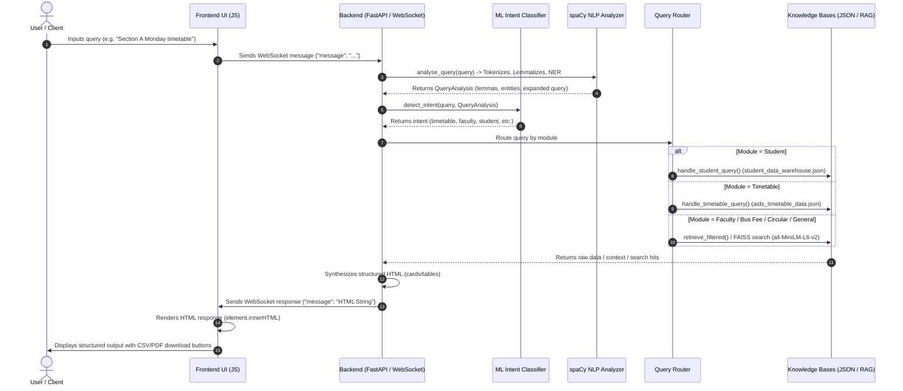

# 🎓 NBKR Institute AI & DS Department RAG Chatbot

An intelligent, state-of-the-art conversational AI assistant and student administration gateway designed specifically for the **Artificial Intelligence & Data Science (AI & DS) Department** at **NBKR Institute of Science & Technology**. The platform leverages a hybrid system combining **Supervised Machine Learning (ML)** for intent classification, **Natural Language Processing (NLP)** for syntactic queries parsing, and **Retrieval-Augmented Generation (RAG)** over vector databases for document search, alongside a standalone **Student Data Warehouse REST API** with dynamic client-side document export options.

---

## 📖 Project Overview

The NBKR Institute AI Chatbot is built to address the highly fragmented nature of college portals, student records, notice boards, and department timetables. It integrates these resources into a single chat window that can understand natural language queries, fetch exact details with high confidence, present structured interactive HTML cards, and offer administrative controls for department staff.

The repository exhibits a dual-architecture design:
1. **Production RAG Chatbot (`rag_chatbot.py`)**: A monolithic, highly optimized FastAPI server driving the live RAG + NLP + ML engine. It uses in-memory JSON data warehouses, custom fuzzy search routines, scikit-learn classifiers, and a `sentence-transformers` + `FAISS` index for semantic retrieval.
2. **Planned Microservices Skeletons (`auth_service/`, `chat_service/`, etc.)**: Skeletons that define a distributed microservices layout configured with PostgreSQL models, Alembic migrations, Redis caching/session stores, Celery task queues, and Prometheus monitoring.

---

## ✨ Features

* 📅 **Dynamic Timetable Management**: Section-specific (A, B, C, D) weekly timetables for multiple academic years (1st, 2nd, 3rd year) rendered in clean, color-coded HTML grids. Features client-side **CSV export** and **PDF print generation** directly from the chat window.
* 👥 **Faculty Directory**: Detailed profiles of department faculty members, detailing their qualifications, contact phone numbers, emails, dates of joining, specializations, and individual weekly teaching timetables.
* 🔍 **RAG Semantic Search**: Core retrieval engine powered by `FAISS` running cosine similarity search over 384-dimensional sentence embeddings, with a confidence-based fallback mechanism.
* 🧠 **Supervised Intent Classification**: Multi-class intent classifier built using a scikit-learn pipeline (TF-IDF Vectorizer + Multinomial Naive Bayes) trained at startup on categorized utterances.
* 💬 **Student Data Warehouse**: Structured database containing student profile info, contacts, academic records, and CGPA. Includes dynamic search and statistical filters (e.g., toppers, CGPA filters).
* 🚌 **Route & Bus Fee Module**: Quick database queries for transport fees and stops across Nellore/Vidyanagar routes.
* 📢 **Announcements & Notice Board**: Renders critical circulars, dates, categories, and payment portal integrations.
* 🔐 **Admin Control Panel**: Embedded, password-protected admin dashboard interface served on `/admin` to perform CRUD operations on faculty timetables, class schedules, circulars, bus fees, and placement lists.
* 🕷️ **Scraping Pipelines**: Pre-built web scrapers using `requests`, `BeautifulSoup4`, and `Playwright` to extract live data from the NBKR IRINS portal, main website, and student portals.

---

## ⚠️ Problem Statement

Accessing academic information in higher education institutions is often a frustrating experience for students and staff. Schedules, curriculum documents, bus routes, exam duties, and student records are scattered across different portals, static PDFs, and physical notices. Finding answers to simple queries like *"What is Section B's timetable on Monday?"*, *"Who teaches Machine Learning?"*, or *"What is the annual bus fee for Nellore?"* requires logging into multiple systems or manually digging through PDF directories.

## 💡 Solution

This project provides a unified, conversational gateway. By preprocessing website pages, faculty portals, and PDF calendars into a single semantic search space, and integrating structured timetables and student directories, the chatbot resolves natural queries instantly. Unstructured questions are routed to a RAG pipeline, structured schedules are handled by custom database queries, and admin users can modify department files on the fly via a single administrative dashboard.

---

## 🛠️ Tech Stack

### 1. Core Programming Languages
* **Python (v3.11)**: Backend logic, ML training, NLP pipelines, data scrapers, and REST APIs.
* **HTML5 / ES6 JavaScript**: Single-Page App (SPA) chat frontend, real-time WebSocket connection, and custom JSON-to-CSV/PDF client exporters.
* **Vanilla CSS3**: Modern dark-mode glassmorphic user interface (glassmorphism cards, purple-to-violet linear gradients, responsive flexbox layout, slide-in animations).

### 2. Frontend Technologies
* **Inter Font**: Loaded from Google Fonts for clean typography.
* **html2canvas (v1.4.1)**: Utilized to capture and export generated timetable HTML cards to PDF.

### 3. Backend Technologies
* **FastAPI (v0.104.1)**: Main web framework providing asynchronous endpoints, WebSocket handling, CORS configuration, and automatic OpenAPI docs.
* **Uvicorn (v0.24.0)**: ASGI web server for running the FastAPI application.
* **Celery (v5.3.4)**: Asynchronous task queue (used in microservices skeletons).

### 4. Machine Learning & Natural Language Processing
* **spaCy (v3.7.2)**: Used with the `en_core_web_sm` model for query tokenization, lemmatization, Part-of-Speech (POS) tagging, Named Entity Recognition (NER), and query expansion.
* **scikit-learn (v1.7.2)**: Machine learning pipeline containing `TfidfVectorizer` and `MultinomialNB` to perform supervised classification of user intents.

### 5. Vector Database & Embedding Models
* **FAISS (v1.13.2)**: In-memory vector database using `IndexFlatIP` (Inner Product) to perform cosine similarity searches over normalized document embeddings.
* **ChromaDB (v0.4.18)**: Persistent vector database client used in the scraping/preprocessing pipeline (`embeddings.py`) to build a local vector index.
* **Sentence Transformers (`all-MiniLM-L6-v2`)**: Embedding model used to encode text chunks into dense 384-dimensional vector spaces.

### 6. Relational Database & ORM (Microservices Skeletons)
* **SQLAlchemy (v2.0.23)**: Database Toolkit and Object-Relational Mapper (ORM) defining SQL schemas and relationships.
* **Alembic (v1.12.1)**: Database migrations manager.
* **psycopg2-binary (v2.9.9) / asyncpg (v0.29.0)**: PostgreSQL database adapters.
* **Redis (v5.0.1)**: Caching and key-value store client for sessions and async task message brokerage.

### 7. Scrapers and Data Extraction
* **Playwright**: Browser automation library used to scrape dynamic student portals and faculty pages.
* **BeautifulSoup4 (v4.12.2)**: Parser for web page contents and HTML tags.
* **pdfplumber (v0.10.3) / pypdf (v3.17.1)**: PDF scrapers to extract academic calendars, timetables, and student lists.
* **pandas (v2.1.3)**: Data manipulation library used to clean scraped data and export to CSV.

---

## 🏢 System Architecture

The chatbot architecture consists of two distinct components: the live production FastAPI server running the core chatbot, and a set of background scraping pipelines that continuously ingestion department data.

### System Architecture Diagram
```mermaid
graph TD
    User([User Client / Browser]) <-->|WebSocket / HTTP| FE[Frontend UI: HTML/CSS/JS]
    FE <-->|FastAPI WebSocket ws://...| BE[Backend Service: rag_chatbot.py]
    subgraph FastAPI Core Backend
        BE --> NLP[NLP Pipeline: spaCy en_core_web_sm]
        BE --> ML[ML Classifier: scikit-learn Naive Bayes + TF-IDF]
        BE --> Router{Query Router}
        Router -->|Student Queries| StudentDB[(Student DW JSON)]
        Router -->|RAG Queries| RetrievalEngine[Retrieval Engine: FAISS Index]
        Router -->|Timetable Queries| TimetableDB[(Timetable JSON)]
        Router -->|Bus/Circular/General| GeneralDB[(JSON Knowledge Bases)]
        RetrievalEngine -->|Vector Search| Vectors[(FAISS IndexFlatIP + all-MiniLM-L6-v2)]
    end
    subgraph Scraping Pipeline (Offline/Pre-process)
        Scrapers[Playwright / BS4 Scrapers] -->|Raw Data| Preprocessor[Preprocessor: preprocess.py]
        Preprocessor -->|Cleaned Data CSV/JSON| Embedder[Embedder: embeddings.py]
        Embedder -->|all-MiniLM-L6-v2| Chroma[(ChromaDB Vector Store)]
        Preprocessor -->|JSON Files| JSON_DBs[JSON Knowledge Bases]
    end
    classDef default fill:#13131a,stroke:#8b5cf6,stroke-width:2px,color:#eeeef2;
    classDef client fill:#0d0d12,stroke:#a78bfa,stroke-width:2px,color:#eeeef2;
    classDef db fill:#1e1e2a,stroke:#22c55e,stroke-width:2px,color:#eeeef2;
    class User,FE client;
    class StudentDB,TimetableDB,GeneralDB,Vectors,Chroma,JSON_DBs db;
```

### Detailed Information Flow:
1. **Data Ingestion**: Scrapers collect data from portals and PDF calendars, storing raw files in `data/raw/`.
2. **Preprocessing & Embeddings**: `preprocess.py` cleans transcripts, and `embeddings.py` generates 384-dim vectors via `all-MiniLM-L6-v2` and persists them in `chroma_db/`.
3. **Monolithic Live Backend (`rag_chatbot.py`)**: Loads structured data (JSONs) and indexes the text chunks into an in-memory `FAISS` index at startup.
4. **Supervised Intent Classification**: The incoming query is classified into one of 10 intents.
5. **Dynamic Routing**: The backend routes structured queries to database modules and unstructured queries to RAG retrieval before compiling the final HTML template.

---

## 📂 Folder Structure

```
dept-ai-master/
├── rag_chatbot.py               # Main Live Chatbot Server (FastAPI + NLP + ML + RAG)
├── config.py                    # Global Pydantic configuration with env validations
├── enhanced_config.py           # Configuration module for LangChain & ChromaDB environments
├── main_scraper.py              # Execution script for the web scraping pipeline
├── faculty_scraper.py           # Scrapes IRINS faculty profile details
├── faculty_scraper_enhanced.py  # Enhanced BS4 scraper for IRINS portal data extraction
├── website_scraper_enhanced.py  # BS4-based scraper for general college pages
├── pdf_scraper.py               # Extracts textual content from academic calendars
├── portal_scraper.py            # Playwright automation script to scrape portal notice boards
├── preprocess.py                # Cleans and formats scraped data into data/cleaned/
├── embeddings.py                # Vector embedding generator targeting ChromaDB
├── aids_timetable_converter.py  # Populates class timetable JSON structures
├── build_faculty.py             # Generates faculty timetable JSON templates
├── update_faculty_tt.py         # Utility script to append individual schedules
├── admin_dashboard.html         # HTML template for admin dashboard interface
├── verify_setup.py              # Validation script to check dependencies and directory structures
├── test_chatbot.py              # CLI test client simulating user queries
├── test_strictness.py           # Validates intent classification bounds and confidence metrics
├── Dockerfile                   # Deployment configuration for core FastAPI app
├── docker-compose.yml           # Microservices container orchestrator
├── Makefile                     # Automation recipes (make setup, run, test, docker-up)
├── Procfile                     # Process file specifying uvicorn startup command
├── render.yaml                  # Configuration blueprint for Render deployment
├── vercel.json                  # Serverless function configuration for Vercel
├── requirements.txt             # Primary production requirements file
├── requirements-lite.txt        # Slim database and security requirements
├── requirements-enhanced.txt    # Extended requirements (ChromaDB, OpenAI, LangChain)
├── data/                        # Contains raw/ and cleaned/ scraped directories
├── database/                    # SQLAlchemy database tables and base classes
│   ├── base.py                  # Declarative SQLAlchemy base class and mixins
│   ├── connection.py            # PostgreSQL database sessions engine
│   └── models.py                # Database entity mappings (User, Session, ChatSession, etc.)
└── [auth,chat,rag,document,notification,admin,analytics]_service/  # Microservice Skeletons
    ├── Dockerfile               # Microservice container definition
    ├── main.py                  # FastAPI service routing skeleton
    └── requirements-lite.txt    # Service packages list
```

---

## ⚡ Tech Stack Usage Analysis

Below is an analysis of each technology used in the project:

| Technology | Purpose in Project | Why Chosen | How Used | Associated Files |
| :--- | :--- | :--- | :--- | :--- |
| **FastAPI** | REST API & WebSockets | High performance, async support, and native Pydantic schemas. | Serves chat page, manages WebSocket connections, and serves CRUD endpoints. | `rag_chatbot.py`, `[service]/main.py` |
| **spaCy** | NLP Analysis | Fast syntactic parsing and entity recognition. | Extracts query lemmas, POS tags, and recognizes names. | `rag_chatbot.py`, `simple_chatbot.py` |
| **scikit-learn** | Supervised Intent Classification | Simple, reliable classifier pipeline. | Classifies queries into intents (greeting, timetable, etc.) with Naive Bayes. | `rag_chatbot.py` |
| **FAISS** | In-memory Vector Index | High-speed semantic search. | Retrives text chunks matching the query embeddings using cosine similarity. | `rag_chatbot.py` |
| **ChromaDB** | Vector DB | Persistent vector database. | Stores vector indices during preprocessing. | `embeddings.py`, `enhanced_config.py` |
| **Sentence Transformers** | Dense Vector Embeddings | Lightweight state-of-the-art embedding model. | Generates 384-dimensional embeddings for retrieved text. | `rag_chatbot.py`, `embeddings.py` |
| **Playwright** | Browser Scraping | Handles dynamic javascript portals. | Logs into college portals and extracts notices. | `portal_scraper.py`, `faculty_scraper.py` |
| **SQLAlchemy** | Database Mapping (ORM) | Secure database abstraction. | Defines schemas and relationships for microservice databases. | `database/models.py`, `database/connection.py` |

---

## ⚙️ Environment Variables (.env)

The application references a comprehensive list of environment configurations (documented in `.env.example`). Below are the primary production options:

```bash
# Application Configuration
APP_NAME="NBKR Institute AI Chatbot"
ENVIRONMENT=production
DEBUG=false
ADMIN_PASSWORD=your_secure_admin_password  # Default is "nbkr2026"

# Server Configuration
API_HOST=0.0.0.0
API_PORT=8000

# Database Configuration (PostgreSQL - Skeletons)
POSTGRES_HOST=db
POSTGRES_PORT=5432
POSTGRES_DB=college_chatbot
POSTGRES_USER=chatbot_user
POSTGRES_PASSWORD=secure_password

# Redis Configuration (Skeletons)
REDIS_HOST=redis
REDIS_PORT=6379

# Vector DB Configuration
VECTOR_DB_TYPE=chromadb
VECTOR_DB_PATH=./chroma_db
VECTOR_DB_COLLECTION=college_data
EMBEDDING_MODEL=sentence-transformers/all-MiniLM-L6-v2

# Security & CORS
CORS_ORIGINS=http://localhost:3000,http://localhost:8080
ENCRYPTION_KEY=your_32_character_encryption_key
```

---

## 📥 Installation Guide

Follow these steps to set up the development environment:

```bash
# 1. Clone the project repository
git clone https://github.com/23kb1a3080-cloud/department_chatbot.git
cd department_chatbot

# 2. Create and activate a Python virtual environment
python -m venv .venv
# On Windows:
.venv\Scripts\activate
# On macOS/Linux:
source .venv/bin/activate

# 3. Install core dependencies
pip install -r requirements.txt

# 4. Download the English NLP model for spaCy
python -m spacy download en_core_web_sm
```

---

## 🚀 Local Setup Instructions

Before launching the chatbot, generate the timetable indices and pre-load database files:

### 1. Initialize Timetable and Faculty Data
Generate the timetable JSON database files from Python models:
```bash
python aids_timetable_converter.py
python build_faculty.py
```

### 2. Populate and Embed Knowledge Base (Optional)
If you want to run the full scraper to fetch fresh website data:
```bash
# (Optional) Install browser binaries for Playwright
python -m playwright install chromium

# Run the scraping pipeline
python main_scraper.py
```
This builds raw scraped data, runs cleanups via `preprocess.py`, and outputs a vector index into `./chroma_db/`.

---

## ▶️ Running the Project

Start the production server using the make command or directly via python:

```bash
# Run server using Makefile
make run

# Or start it directly using Python
python rag_chatbot.py
```

Open your browser and navigate to: **[http://localhost:8000](http://localhost:8000)**

---

## 📡 API Endpoints

The core server serves both HTTP and WebSocket interfaces:

### Web Interface
* **`GET /`**: Renders the glassmorphic Single Page Application.
* **`GET /admin`**: Serves the administrative database CRUD panel.

### Live Chat
* **`WS /ws`**: Primary WebSocket route for handling real-time query inputs and HTML template outputs.

### Analytics & System Health
* **`GET /health`**: Returns engine status details, models loaded, total active records, and confidence limits.
* **`GET /admin/failed-queries`**: Fetches query strings that triggered fallback logic.
* **`GET /admin/audit/list`**: Fetches historical administrative changes.

### Student CRUD API (REST)
* **`GET /students`**: Fetches all student records, with optional `branch` and `section` queries.
* **`GET /students/{roll_no}`**: Fetches profile information for a student by roll number.
* **`POST /students`**: Creates a new student record (Admin only).
* **`PUT /students/{roll_no}`**: Updates profile information for a student by roll number (Admin only).
* **`DELETE /students/{roll_no}`**: Removes a student from the database (Admin only).

---

## 🗄️ Database Schema

The database architecture is designed to support the planned microservices skeletons using SQLAlchemy ORM models.

### Database Flow Diagram
```mermaid
graph LR
    Admin[Admin Client / Dashboard] -->|HTTP REST API| API[FastAPI Admin Endpoints]
    API -->|PostgreSQL Models| PG[(PostgreSQL DB Skeleton)]
    API -->|Read/Write Operations| Memory[In-Memory JSON Stores]
    Memory <-->|Disk Sync| FileDBs[(JSON Databases)]
    
    subgraph JSON Database Files
        FileDBs --- S_DW[student_data_warehouse.json]
        FileDBs --- F_DB[aids_faculty_data.json]
        FileDBs --- T_DB[aids_timetable_data.json]
        FileDBs --- C_DB[nbkr_circulars.json]
        FileDBs --- B_DB[nbkr_bus_fees.json]
    end
    
    subgraph ORM Models (Skeleton)
        PG --- Users[Users Table]
        PG --- Sessions[Sessions Table]
        PG --- ChatSessions[Chat Sessions]
        PG --- Docs[Documents]
        PG --- KB[Knowledge Base]
    end
    
    classDef default fill:#13131a,stroke:#8b5cf6,stroke-width:2px,color:#eeeef2;
    classDef file fill:#1e1e2a,stroke:#22c55e,stroke-width:2px,color:#eeeef2;
    classDef sql fill:#1e1e2a,stroke:#3b82f6,stroke-width:2px,color:#eeeef2;
    class S_DW,F_DB,T_DB,C_DB,B_DB file;
    class Users,Sessions,ChatSessions,Docs,KB sql;
```

### Table Mappings:
1. **users**: Primary user profiles with MFA options, credentials, and links to user roles.
2. **roles**: Role-based access controls defining permissions (admin, faculty, student).
3. **sessions**: Tracks OAuth sessions, IP mappings, user agents, and tokens.
4. **chat_sessions & chat_messages**: Stores conversations, response metrics, and user feedback ratings.
5. **documents**: Tracks file uploads, parsing status, and text metadata.
6. **knowledge_base**: Stores document chunks and their associated vector database IDs.
7. **notifications**: Manages email, SMS, and in-app notifications.

---

## 🧠 AI/LLM Workflow

The application runs a local, privacy-centric AI workflow using open-source models:

```
User Input Query
      │
      ▼
Intent Classification (TF-IDF + Naive Bayes Classifier)
      │
      ├─► ["greeting", "farewell", "help"] ────────► Predefined Template Response
      │
      └─► ["timetable", "faculty", "student"...] ──► Module Classification
                                                           │
                                                           ▼
                                                    Retrieve Context
                                                           │
                                                           ├─► Structured JSON Lookup
                                                           │
                                                           └─► Semantic Vector Search
                                                               (Sentence Transformers + FAISS)
                                                                   │
                                                                   ▼
                                                             Response Synthesis
                                                             (Structured HTML output)
```

---

## 💬 Chatbot Working Process

The chatbot processes user messages sequentially:

### Chatbot Workflow Diagram


1. **Syntactic NLP Parsing**: spaCy breaks the query down into tokens, extracts lemmas, isolates named entities (e.g., PERSON names), and expands the query with additional keywords.
2. **Intent Classification**: Multinomial Naive Bayes evaluates the query's term frequencies and determines the intent. If confidence falls below 45%, a rule-based lookup on POS tags serves as a fallback.
3. **Module Routing**: The query is routed to a specific service.
4. **FAISS Retrieval**: For vector queries, the text is encoded via `all-MiniLM-L6-v2`. FAISS searches the index for similar documents using cosine similarity.
5. **Fuzzy Fallback**: If the vector similarity score is below 30%, the query is routed to a secondary fuzzy search that matches keywords.
6. **Response Generation**: If both searches fail to cross the confidence threshold, the chatbot falls back to: *"I don't know the answer to that question. Please contact the department office or administrator."*
7. **HTML Rendering**: Successful queries are wrapped in responsive HTML cards and tables and returned via WebSockets to the client.

---

## 🔒 Security Features

* **Admin Authentication**: Administrative endpoints require verification via an `X-Admin-Password` header (configured via the `ADMIN_PASSWORD` env variable).
* **Audit Trails**: Security audits are logged to `admin_audit.json` showing action timestamps and admin details.
* **CORS Restrictions**: Port configurations in `config.py` limit request origins to trusted development domains.
* **Security Scans**: The server Dockerfile runs on a slim Python image, excludes source code comments from production builds, and runs under a non-privileged system user to prevent container privilege escalation.

---

## 🚢 Deployment Guide

The chatbot is production-ready and can be deployed to various environments:

### Deployment Architecture Diagram
```mermaid
graph TD
    subgraph Local Dev Environment
        Venv[Python Virtual Env]
        CLI[start_chatbot.ps1 / CLI scripts]
        ComposeLocal[docker-compose up]
    end
    
    subgraph Production Cloud (Render / Railway / HuggingFace)
        Client[User Web Browser] -->|HTTPS Requests / WSS WebSockets| WebService[Render Web Service]
        WebService -->|Build Command| Build[Install requirements.txt & spaCy model]
        WebService -->|Start Command| Run[uvicorn rag_chatbot:app --host 0.0.0.0 --port $PORT]
    end
    
    subgraph Containerized Orchestration (Docker Skeleton)
        Compose[docker-compose.yml] --> AppSvc[FastAPI Chat Service Container]
        Compose --> AuthSvc[Authentication Service Container]
        Compose --> RAGSvc[RAG Service Container]
        Compose --> DocSvc[Document Service Container]
        Compose --> RedisSvc[(Redis Session & Celery Cache Container)]
        Compose --> PGSvc[(PostgreSQL Database Container)]
    end
    
    classDef default fill:#13131a,stroke:#8b5cf6,stroke-width:2px,color:#eeeef2;
    classDef prod fill:#1e1e2a,stroke:#22c55e,stroke-width:2px,color:#eeeef2;
    class Client,WebService,Build,Run prod;
```

### Deploying to Render (Recommended)
1. Sign up on [Render](https://render.com) using your GitHub account.
2. Click **New +** → **Web Service** and connect your repository.
3. Configure the service:
   * **Name**: `nbkr-chatbot`
   * **Environment**: `Python 3`
   * **Build Command**: `pip install -r requirements.txt && python -m spacy download en_core_web_sm`
   * **Start Command**: `uvicorn rag_chatbot:app --host 0.0.0.0 --port $PORT`
   * **Plan**: `Free`
4. Click **Create Web Service**.

### Deploying via Docker Compose
Build and run the entire application stack:
```bash
docker-compose up --build
```

---

## 🧪 Testing

The repository contains several testing files to validate the chatbot's performance:

* **`pytest`**: Run the automated test suite.
  ```bash
  pytest
  ```
* **Strictness Validation**: Verify that intent classification bounds and confidence metrics are strictly enforced:
  ```bash
  python test_strictness.py
  ```
* **Deployment Setup Check**: Run the automated setup check to verify that all database files and folder structures are present:
  ```bash
  python verify_setup.py
  ```

---

## 🔮 Future Enhancements

1. **Distributed Databases**: Migrate the in-memory JSON data warehouses to the PostgreSQL schema defined in `database/models.py`.
2. **Context Memory**: Support conversational history using Redis session stores to keep track of user context.
3. **External ERP Integrations**: Integrate live ERP REST APIs for real-time attendance and academic grades lookups.
4. **Dynamic Notice Syncing**: Run background Celery tasks to scrape portal updates every 30 minutes and re-index the vector store automatically.

---

## 📌 Challenges Faced

* **Directory Name Parsing**: Local tools running on Windows can run into issues with directory names that contain spaces or parentheses (e.g. `dept-ai-master (1)`).
* **Compiling FAISS on Windows**: Installing `faiss-cpu` on Windows environments requires compiling C++ libraries, which is resolved by using pre-built binary wheels.
* **Cold Starts on Free Tiers**: Hosting services like Render sleep after 15 minutes of inactivity. Adding connection state handshakes in the WebSocket client helps prevent client timeouts during cold starts.

---

## 💡 Learnings

* **Hybrid Intent Systems**: Combining classical machine learning classifiers (Naive Bayes) for intent routing with dense vector search (RAG) significantly reduces computational overhead.
* **Structured UI Elements**: Returning pre-rendered HTML components from the backend allows the chatbot to display structured data (like timetables) consistently without complex frontend parsing.

---

## 🖼️ Screenshots Section

Here is a preview of the chatbot's user interface:

| Welcome Interface | Timetable Export |
| :---: | :---: |
|  |  |

---

## 🤝 Contributing

1. Fork the Project Repository.
2. Create a Feature Branch (`git checkout -b feature/NewFeature`).
3. Commit your Changes (`git commit -m 'Add NewFeature'`).
4. Push to the Branch (`git push origin feature/NewFeature`).
5. Open a Pull Request.

---

## 📄 License

Distributed under the MIT License. See `LICENSE` for details.

---

## 👨‍💻 Author

**AI & DS Department**  
NBKR Institute of Science & Technology  
Vidyanagar, Nellore District, Andhra Pradesh, India  
GitHub: [@23kb1a3080-cloud](https://github.com/23kb1a3080-cloud)  
Website: [https://www.nbkrist.org](https://www.nbkrist.org)
